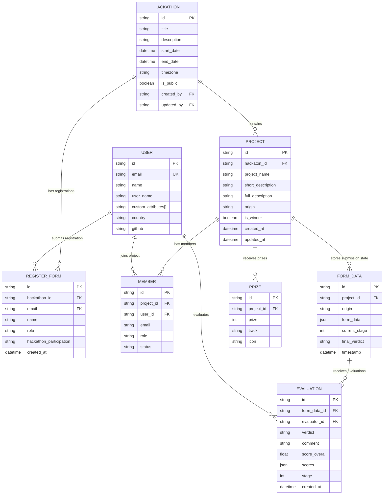
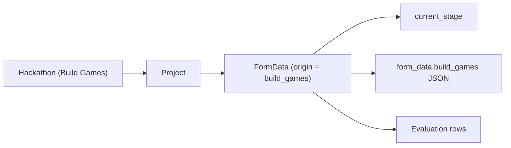

# Hackathon and Project Schema

This is a compact map of the Builder Hub schema around hackathons, projects, registrations, members, submissions, and judging.

## Core Entity Diagram

## How To Read It

- `Hackathon -> Project` is the main parent/child relationship.
- `Hackathon -> RegisterForm -> User` tracks registrations for a hackathon.
- `Project -> Member -> User` tracks who belongs to the team.
- `Project -> FormData` holds submission state and program-specific payloads.
- `FormData -> Evaluation -> User` is the judging / review flow.
- `Project -> Prize` is the public project prize relation already in BH.

## Build Games Notes

For Build Games specifically, the important current path is:

- the Build Games project still lives in `Project`
- stage and submission state live in `FormData`
- the stage field already used by Builder Hub is `FormData.current_stage`
- Build Games-specific submission payloads live under `form_data.build_games`
- evaluations are attached to the relevant `FormData` row

So the practical Build Games chain today is:

## Important Implementation Notes

- The actual foreign key field on `Project` is named `hackaton_id` in the schema.
- `User.custom_attributes` is a `String[]`, not a JSON role object.
- `FormData` is the correct place to look for Build Games progression and review state.
