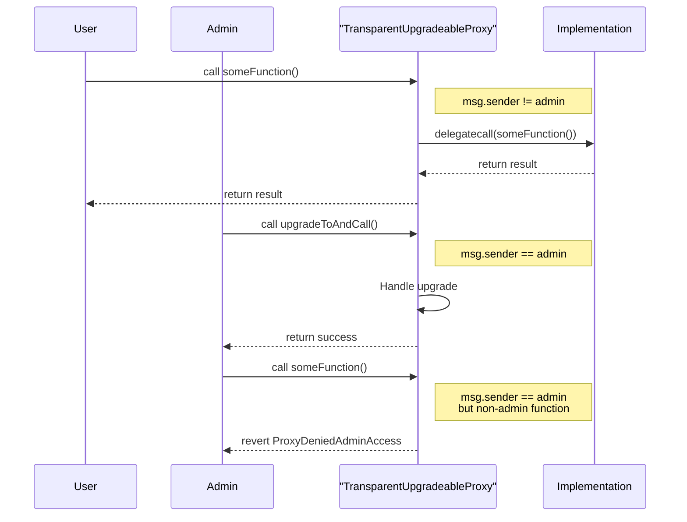

## Introduction to Proxy Patterns

In blockchain development, upgradeability presents a fundamental challenge: smart contracts are immutable by design, yet real-world applications often require the ability to fix bugs, add features, or adapt to changing requirements. Proxy patterns offer a solution to this dilemma by separating contract logic from data storage, enabling upgrades while maintaining the same contract address.

<Callout type="info">
**Proxy patterns are architectural designs that allow smart contracts to be upgraded after deployment without changing their address or losing their state.**
</Callout>

## How Proxy Patterns Work

At its core, a proxy pattern involves two main components:

1. **Proxy Contract**: Holds the permanent address and stores all contract state
2. **Implementation Contract**: Contains the actual business logic that can be upgraded

When users interact with the proxy contract, it delegates all calls to the implementation contract using the `delegatecall` opcode, executing the implementation's code in the proxy's storage context.

```
User → Proxy Contract → delegatecall → Implementation Contract
         (storage)                         (logic)
```

## Common Proxy Patterns

### 1. Transparent Proxy Pattern

The Transparent Proxy pattern, developed by OpenZeppelin, ensures clear separation between admin and user interactions:

- Admin calls are handled by the proxy itself
- User calls are delegated to the implementation
- Prevents function selector clashes between proxy and implementation

### 2. UUPS (Universal Upgradeable Proxy Standard)

UUPS moves the upgrade logic to the implementation contract itself:

- More gas-efficient than transparent proxies
- Implementation controls its own upgradeability
- Requires careful implementation to avoid locking upgrades

### 3. Beacon Proxy Pattern

Beacon proxies enable multiple proxy instances to share the same implementation:

- All proxies point to a single beacon contract
- Beacon contract holds the implementation address
- Upgrading the beacon updates all proxy instances simultaneously

## Advantages of Proxy Patterns

### 1. **Upgradability Without Address Changes**
Users and integrations can continue using the same contract address even after upgrades, preserving:
- User interfaces and bookmarks
- Exchange listings and integrations
- Historical transaction references

### 2. **Bug Fixes and Security Patches**
Critical vulnerabilities can be addressed without requiring users to migrate to a new contract:
- Rapid response to security incidents
- Minimal disruption to users
- Preservation of contract state

### 3. **Feature Addition and Optimization**
New functionality can be added over time:
- Gas optimization improvements
- New features based on user feedback
- Integration with newer protocols

### 4. **Storage Persistence**
Contract state remains intact across upgrades:
- User balances preserved
- Historical data maintained
- No migration required

## Risks and Considerations

<Callout type="warning">
**While proxy patterns offer flexibility, they introduce significant risks that must be carefully managed.**
</Callout>

### 1. **Centralization Risk**
Upgrade capabilities often rest with a single admin or small group:
- Single point of failure
- Trust assumptions contradict decentralization
- Potential for malicious upgrades

**Mitigation**: Implement time-locks, multi-signature wallets, or decentralized governance

### 2. **Storage Collision**
Improper storage layout management can corrupt data:
- New variables must be appended, never inserted
- Storage slots must align between versions
- Inheritance changes can break storage layout

**Mitigation**: Use storage gaps and careful upgrade testing

### 3. **Function Selector Clashes**
Proxy and implementation functions can have matching selectors:
- Unexpected behavior
- Security vulnerabilities
- Upgrade failures

**Mitigation**: Careful function naming and selector verification

### 4. **Complexity and Gas Costs**
Proxy patterns add complexity:
- Additional gas costs for delegatecall
- Harder to audit and verify
- More potential for implementation errors

## Best Practices

1. **Governance and Access Control**
   - Implement multi-signature or DAO governance for upgrades
   - Use time-locks to allow users to exit before upgrades
   - Consider making contracts eventually immutable

2. **Thorough Testing**
   - Test upgrades on testnets first
   - Verify storage layout compatibility
   - Audit both proxy and implementation contracts

3. **Clear Documentation**
   - Document upgrade procedures
   - Maintain upgrade history
   - Communicate changes to users

4. **Consider Alternatives**
   - Modular design with replaceable components
   - Parameter adjustment without code changes
   - Off-chain computation with on-chain verification

## Conclusion

Proxy patterns represent a powerful tool in the blockchain developer's toolkit, enabling the evolution of smart contracts while maintaining continuity for users. However, they must be implemented thoughtfully, with careful consideration of the trade-offs between flexibility and decentralization. As the blockchain ecosystem matures, proxy patterns continue to evolve, offering new approaches to balance upgradeability with security and trust minimization.

When implementing proxy patterns, always prioritize security, transparency, and user trust. The ability to upgrade should enhance, not compromise, the fundamental principles of blockchain technology.

## Appendix: Proxy Flow

The following diagram illustrates the flow of interactions in a Transparent Proxy pattern, showing how different types of calls are handled:

